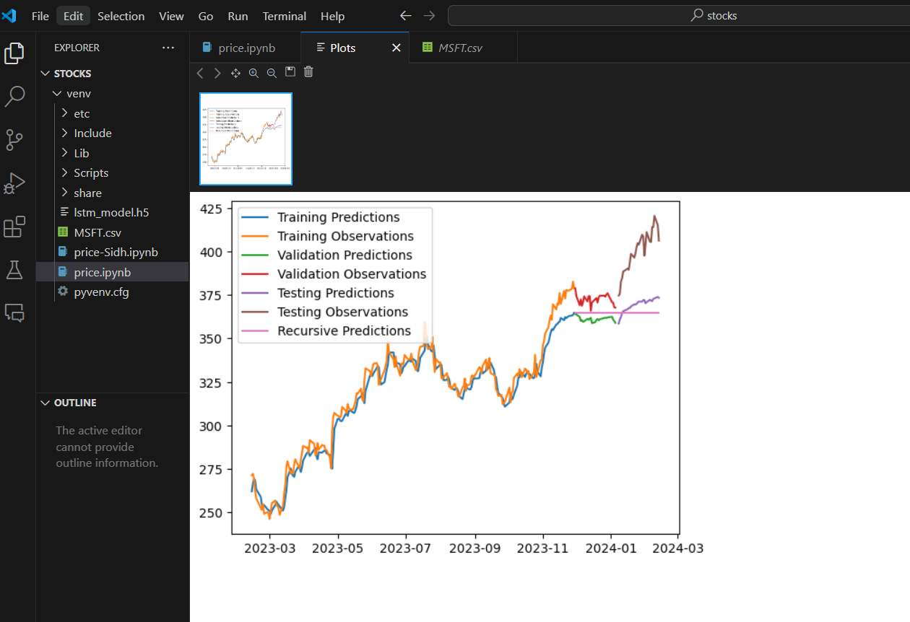
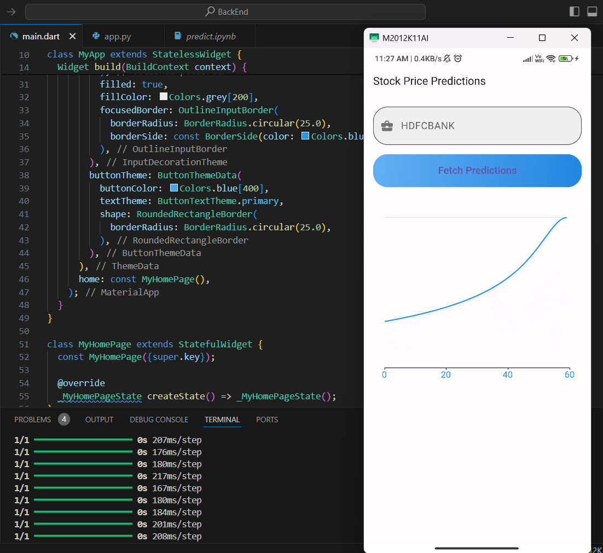
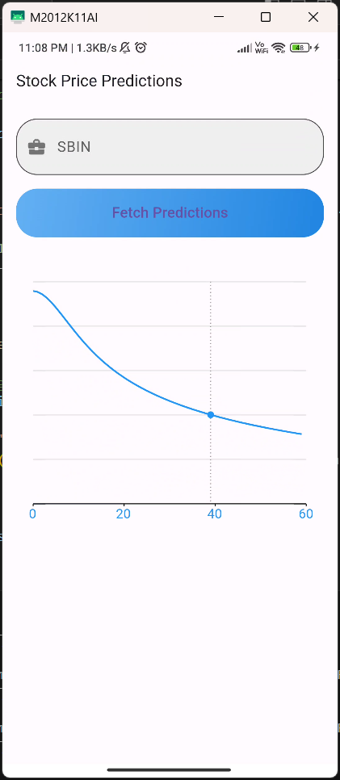

This project describes the development of a Flutter mobile application that functions as a stock price prediction tool. Users can enter a stock ticker symbol and retrieve predictions from a Flask API endpoint leveraging a trained Long Short-Term Memory (LSTM) network model. 

The application facilitates user interaction through a Flutter interface, allowing for ticker symbol input and displaying predicted price information. The Flask API, acting as the backend, receives these requests, utilizes the LSTM model for prediction, and returns the results. 

By combining mobile development, machine learning, and API communication, this project delivers a valuable tool for users to explore and gain insights into potential stock market trends. It's important to acknowledge that stock price prediction remains inherently uncertain, and the application serves as an informational aid, not definitive investment advice. 

  
  
  
  

